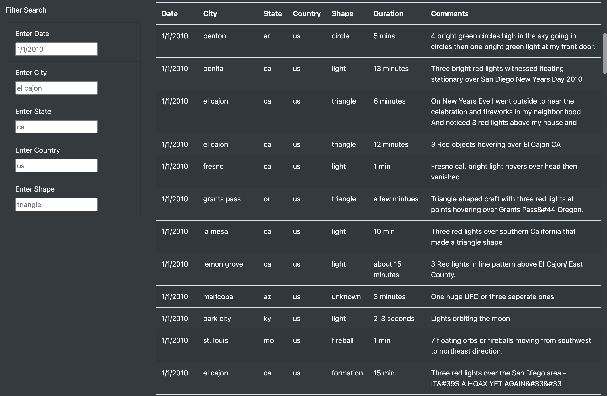
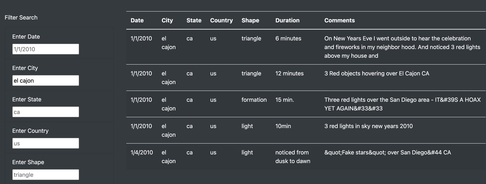

# UFO Analysis

## Overview

For this project we are displaying a table of UFO sighting data using HTML, CSS, and JavaScript. We want to be able to filter data shown in the table dynamically on the webpage.

## Results

We can search Date, City, State, Country, and Shape data from the sighting and have data that matches the searches be the only results that appear in the table. In order to do this we type in what criteria we want searched for then move the cursor out of the box for the page to apply the filter.

## Summary
	
One drawback of the page is there isn’t a message that appears if criteria that has been searched is not in the dataset. This can be confusing for the end user if no results show up for what they have typed.

Some things that could be improved upon for this page is adding an error message for the above-mentioned issue. Another thing that could be improved upon is adding a selectable shape selector for certain fields. While having the ability to type in date and shape, having enterable drop down fields would make the experience more user friendly and have less margin for error.
